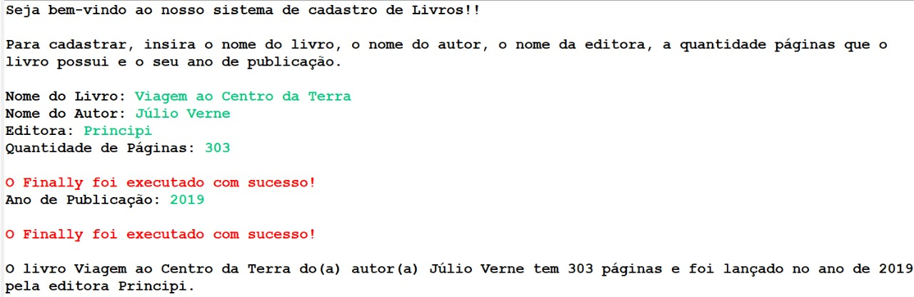

# Livraria
* Atividade Java do segundo semestre da faculdade na matéria de Linguagem de Programação.

* A atividade consiste em um sistema básico de cadastro de livros sem e com interface gráfica Java + o tratamento de exceptions.

* Um sistema de cadastro de Livros em que o bibliotecário ou responsável poderá inserir informações sobre os livros como nome do livro, nome do autor, quantidade de páginas, ano de publicação e editora, sendo que será inválido inserir letras em quantidade de páginas e ano de publicação.  

## Trabalhando o cadastro de Livros sem a interface gráfica e com duas exceptions, a InputMismatchException e a NoSuchElementException.

 </img>
* Para saber a execução das exceptions citadas acima basta olhar o arquivo CadastroLivraria.java 
 

 
## Cadastro de Livros na Interface gráfica e com exception.
### Tela Inicial
    </img> 
   
   * Entrando com dados válidos para cada campo:
   
    </img>
   
   
   * O usuário poderá digitar letras em quantidade de páginas e ano de publicação: 
   
    </img>
    
   ###  Mas ao entrar com esses dados que NÃO SÃO INTEIROS VÁLIDOS, aparecerá pop(s) informando o(s) erro(s) e a exception gerada:
    </img>  </img>
   
   * Pop-up finally aparecerá tanto ao entrar com dados válidos quanto inválidos.

    </img>
   

